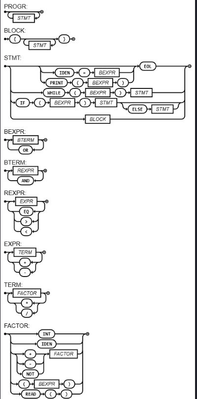

# lingpar

Compilador/interpretador de uma linguagem própria, inspirada em Rust.

[](https://compiler-tester.insper-comp.com.br/svg/NicolasVolf/lingpar)

O badge acima é gerado automaticamente pelo compiler-tester do Insper: ele roda o projeto
contra a bateria oficial de testes da disciplina a cada atualização e reporta o status.

## Sobre

Projeto desenvolvido na disciplina de Lógica da Computação do Insper. O objetivo é
implementar, do zero, um compilador/interpretador para uma linguagem própria com sintaxe
inspirada em Rust — desde a leitura do código-fonte até a geração de código assembly.

## A linguagem

Suporta:

- Funções com parâmetros tipados e retorno (`fn nome(a: i32, b: i32) -> i32 { ... }`)
- Controle de fluxo: `if` / `else`, `while`
- Tipos primitivos: `i32`, `str`, `bool`
- Expressões aritméticas (`+ - * /`) e booleanas (`&& || !`, `== < >`)
- Entrada e saída: `scanln!()` e `println!(...)`
- `struct` com declaração de campos e acesso por `.campo`

Exemplo:

```rust
fn fatorial(n: i32) -> i32 {
    let mut i: i32 = 1;
    let mut f: i32 = 1;
    while (i < n || i == n) {
        f = f * i;
        i = i + 1;
    }
    return f;
}

fn main() -> () {
    let mut n: i32;
    n = scanln!();
    println!(fatorial(n));
}
```

## Etapas implementadas

O `main.py` implementa as fases clássicas de um compilador, em sequência:

1. **Pré-processamento** (`PrePro`) — remove comentários do código-fonte.
2. **Análise léxica / tokenização** (`Lexer`) — transforma o texto em uma sequência de tokens.
3. **Análise sintática** (`Parser`) — parser de descida recursiva que consome os tokens e
   monta a árvore sintática (AST), seguindo a gramática EBNF abaixo.
4. **Análise semântica** — feita junto com a interpretação, usando uma tabela de símbolos
   (`SymbolTable`) que valida tipos, mutabilidade e escopo de variáveis, funções e structs.
5. **Interpretação** — cada nó da AST sabe se `evaluate`ar, então o programa é executado
   diretamente sobre a árvore.
6. **Geração de código** — cada nó também sabe se `generate`, emitindo instruções NASM
   (x86, 32 bits) equivalentes ao programa, com chamadas a `printf`/`scanf` da libc para
   entrada e saída.

> Limitação conhecida: a geração de código cobre inteiros e todo o controle de fluxo, mas
> `struct` hoje só funciona no modo interpretado (não é emitido em assembly), e parâmetros
> de função do tipo `str` também não são suportados pelo codegen.

## Como rodar

Requer Python 3. Para interpretar um programa e gerar o assembly correspondente:

```bash
python main.py tests/teste_funcao.rs
```

Isso executa o programa (imprimindo a saída no terminal) e grava
`tests/teste_funcao.asm`. Para montar e rodar o binário resultante (Linux, NASM):

```bash
nasm -f elf32 tests/teste_funcao.asm
ld -m elf_i386 -o teste_funcao tests/teste_funcao.o -lc -I /lib/ld-linux.so.2
./teste_funcao
```

Mais exemplos de programas em [`tests/`](tests/), com o que cada um exercita.

## Estrutura do repositório

```
main.py                  compilador/interpretador (lexer, parser, semântica, codegen)
tests/                    programas de exemplo em lingpar
diagrama-sintatico.png    diagrama sintático da gramática (Roteiro 9)
```

## Diagrama sintático e EBNF final (Roteiro 9)



```ebnf
PROGRAM = { FUNCDEC | VARDEC } ;
FUNCDEC = "fn", IDENTIFIER, "(", ( | IDENTIFIER, ":", TYPE, { ",", IDENTIFIER, ":", TYPE }), ")", ("->", (TYPE | "(", ")") | ), BLOCK ;
VARDEC = "let", "mut", IDENTIFIER, ":", TYPE, ( | "=", BOOLEXPRESSION ), ";" ;
BLOCK = "{", { STATEMENT }, "}" ;
STATEMENT = ( | (IDENTIFIER, ("=", BOOLEXPRESSION | "(", (BOOLEXPRESSION, { ",", BOOLEXPRESSION } | ), ")")) | ("println!", "(", BOOLEXPRESSION, ")") | "return", BOOLEXPRESSION | ), ";"
          | ("if", "(", BOOLEXPRESSION, ")", STATEMENT, ( | "else", STATEMENT))
          | ("while", "(", BOOLEXPRESSION, ")", STATEMENT)
          | VARDEC
          | BLOCK ;
BOOLEXPRESSION = BOOLTERM, { "||", BOOLTERM } ;
BOOLTERM = RELEXPRESSION, { "&&", RELEXPRESSION } ;
RELEXPRESSION = EXPRESSION, {("==" | "<" | ">"), EXPRESSION} ;
EXPRESSION = TERM, { ("+" | "-"), TERM } ;
TERM = FACTOR, { ("*" | "/"), FACTOR } ;
FACTOR = NUMBER
       | STRING
       | BOOLEAN
       | IDENTIFIER, ("(", (BOOLEXPRESSION, { ",", BOOLEXPRESSION } | ), ")" | )
       | ("+" | "-" | "!"), FACTOR
       | "(", BOOLEXPRESSION, ")"
       | "scanln!", "(", ")" ;
TYPE = "i32" | "str" | "bool" ;
NUMBER = DIGIT, { DIGIT } ;
IDENTIFIER = LETTER, {LETTER | DIGIT | "_"} ;
STRING = '"..."' ;
DIGIT = "0" | "..." | "9" ;
LETTER = "a" | "..." | "z" | "A" | "..." | "Z" ;
BOOLEAN = "true" | "false" ;

```

Nota: `struct` foi adicionado à linguagem após o Roteiro 9, então não aparece nesta EBNF —
ela é mantida como foi entregue na disciplina.
